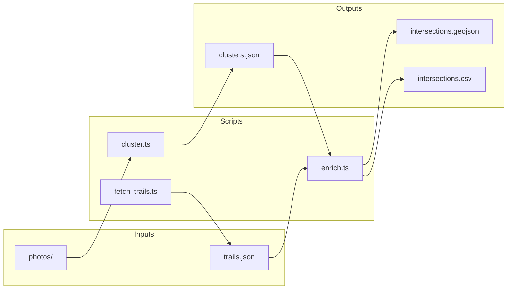

# Kimberley Signage Survey - Implementation Plan

Turn geotagged trail photos into clustered locations and enriched map outputs for the Kimberley Nature Trail Society.

---

## Overview

Three scripts, no CLI args. Paths and config are hardcoded or in a config file.



---

## Stack

- **Runtime:** Bun
- **EXIF:** npm package (not exiftool CLI)
- **Spatial:** Turf.js (`@turf/distance`, `@turf/point-to-line-distance`)

---

## Config (no CLI args)

Paths and constants live in `config.ts` or at top of each script:

| Key | Value |
|-----|-------|
| `photos_path` | `photos/` |
| `clusters_path` | `data/clusters.json` |
| `trails_path` | `data/trails.json` |
| `cluster_threshold_m` | 10 |
| `intersection_buffer_m` | 15 (added to `radius_m`) |
| `region_id` | 3023 (Kimberley on Trailforks) |

---

## 1. cluster.ts

**Input:** `photos/` directory (JPEG/HEIC)

**Processing:**
- Extract GPS and timestamp from each photo via npm EXIF library
- Error and exit if any photo lacks GPS
- Single-linkage clustering: merge photos within 10m of each other (transitive). Use Turf `distance()` (Haversine)
- Cluster center = mean of photo coordinates
- Cluster radius = max distance from center to any photo
- Cluster ID = geohash of center (e.g. `cluster_c2x8b`)

**Output:** `data/clusters.json`

```json
{
  "clusters": [
    {
      "cluster_id": "cluster_c2x8b",
      "center": { "lat": 49.6812, "lon": -115.9856 },
      "radius_m": 3.2,
      "photos": [
        {
          "filename": "PXL_20260206_172856966.jpg",
          "lat": 49.68119,
          "lon": -115.98562,
          "timestamp": "2026-02-06T17:28:56",
          "distance_from_center_m": 0.3
        }
      ]
    }
  ]
}
```

---

## 2. fetch_trails.ts

**Purpose:** Fetch trail geometry and metadata from Trailforks, store locally.

**Strategy:**
1. Try Trailforks API (requires API access). Region ID 3023. Sequential requests, configurable delay between (e.g. 1–2s).
2. If no API access: Playwright path. Script launches browser, navigates to https://www.trailforks.com/region/kimberley-3023/, injects extraction script via `page.evaluate()`, captures trail data from the map.
3. Fallback: Provide `extract.js` (plain JS) for manual run in browser console. User saves output to `data/trails.json`.

**Output:** `data/trails.json` – GeoJSON FeatureCollection or equivalent:
- Each trail = LineString geometry + properties: `name`, `winter` (fat bike), `ski_trails`

**Rate limiting:** 1 request at a time, delay between requests.

---

## 3. enrich.ts

**Input:** `data/clusters.json`, `data/trails.json`

**Processing:**
- For each cluster, find trails where cluster center is within `radius_m + 15` metres of trail line (Turf `pointToLineDistance`)
- Compute: `trail_names`, `trail_count`, `winter` (true if any intersecting trail is fat bike), `ski_trails` (true if any intersecting trail is ski)
- Include clusters with no intersecting trails; log them as warnings

**Output:**
- `data/intersections.geojson` – Point features, properties: `cluster_id`, `trail_count`, `trail_names`, `winter`, `ski_trails`, `lat`, `lon`, `radius_m`, `photos`
- `data/intersections.csv` – same columns; arrays as comma-separated strings

GeoJSON example (Kimberley BC coords):

```json
{
  "type": "FeatureCollection",
  "features": [
    {
      "type": "Feature",
      "geometry": { "type": "Point", "coordinates": [-115.9856, 49.6812] },
      "properties": {
        "cluster_id": "cluster_c2x8b",
        "trail_count": 2,
        "trail_names": ["Lazy Elk", "North Star Connector"],
        "winter": true,
        "ski_trails": false,
        "lat": 49.6812,
        "lon": -115.9856,
        "radius_m": 3.2,
        "photos": ["PXL_20260206_172856966.jpg", "PXL_20260206_173334048.jpg"]
      }
    }
  ]
}
```

CSV column order: `cluster_id`, `trail_count`, `trail_names`, `winter`, `ski_trails`, `lat`, `lon`, `radius_m`, `photos`

---

## Folder Layout

```
project/
  photos/
  src/
    config.ts
    cluster.ts
    fetch_trails.ts
    enrich.ts
    extract.js       # manual browser console snippet
  data/
    clusters.json    # output of cluster
    trails.json      # output of fetch_trails
    intersections.geojson
    intersections.csv
  package.json
```

---

## Run Order

- `cluster` and `fetch_trails` are independent (can run in any order, or parallel)
- `enrich` requires both `data/clusters.json` and `data/trails.json`
- If enrich runs before either exists, fail with clear error

---

## Behaviour Summary

| Scenario | Behaviour |
|----------|-----------|
| Photo without GPS | Skip and log warning |
| Cluster with no intersecting trails | Include in output, log warning |
| Trailforks API access | Use API; fallback to Playwright or manual extract.js |
| Cluster ID | Geohash of center |

---

## Implementation Progress

| Component | Status |
|-----------|--------|
| package.json + config.ts | Done |
| cluster.ts | Done – 92 clusters from 274 photos |
| fetch_trails.ts | Done – Playwright (may need `all` perms in sandbox); use `--print-snippet` for manual extract.js |
| enrich.ts | Done |
| extract.js | Done – manual browser console fallback |

**Run order:**
```bash
bun install
bun run cluster
bun run fetch_trails      # or run extract.js manually, save to data/trails.json
bun run enrich
```
